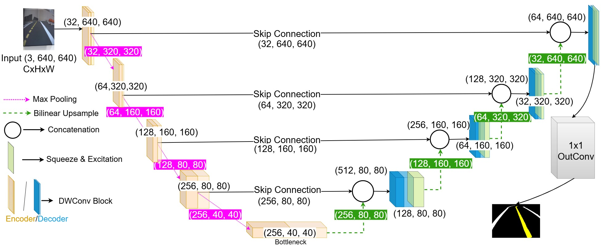

# Lane Segmentation using LaneNet

Clean, reproducible  lane segmentation experiments with from the paper "Towards Context-Aware Autonomous Driving in
Degraded Urban Environments using LaneNet". This repo includes an explicit vanilla U-Net baseline and a configurable U-Net family for ablations. 


## Model Architecture


## Features

- Explicit `vanilla_unet` baseline that returns logits only.
- `configurable_unet` with fair outer topology and optional:
  - depthwise separable convolutions
  - SE decoder attention
  - ASPP-lite bottleneck context
- Multi-class segmentation losses built around logits:
  - `focal_dice`
  - `dice_ce`
  - `dsc`
  - `cross_entropy`
- Metrics for research comparisons:
  - mean IoU
  - per-class IoU
  - Dice score
  - per-class precision, recall, F1
  - lane-only pixel F1
  - boundary F1
- Training artifacts:
  - best checkpoint by validation mIoU
  - final checkpoint
  - per-epoch CSV log
  - resolved config snapshot
  - summary JSON
- Optional `wandb` logging and optional profiling utilities.

## Repository Layout

```text
.
├── README.md
├── requirements.txt
├── pyproject.toml
├── .gitignore
├── configs
│   ├── model
│   │   ├── vanilla.yaml
│   │   ├── depthwise.yaml
│   │   ├── se_decoder.yaml
│   │   ├── aspp.yaml
│   │   ├── depthwise_se.yaml
│   │   ├── depthwise_aspp.yaml
│   │   ├── se_aspp.yaml
│   │   └── full.yaml
│   └── train
│       ├── default.yaml
│       ├── focal_dice.yaml
│       ├── dice_ce.yaml
│       └── dsc.yaml
├── scripts
│   ├── train.py
│   ├── evaluate.py
│   └── run_all.sh
├── src
│   └── duckietown_seg
│       ├── __init__.py
│       ├── data
│       │   ├── dataset.py
│       │   └── transforms.py
│       ├── models
│       │   ├── __init__.py
│       │   ├── blocks.py
│       │   ├── vanilla_unet.py
│       │   └── configurable_unet.py
│       ├── losses
│       │   └── segmentation_losses.py
│       ├── metrics
│       │   └── segmentation_metrics.py
│       ├── engine
│       │   ├── trainer.py
│       │   └── evaluator.py
│       └── utils
│           ├── config.py
│           ├── seed.py
│           ├── io.py
│           ├── logging.py
│           └── profiling.py
└── outputs
    └── .gitkeep
```

## Dataset Layout

The training config expects the dataset root to point to a folder like this:

```text
datasets/
├── trainTRACKimg/
│   ├── 0.jpg
│   ├── 1.jpg
│   └── ...
└── trainTRACKmask/
    ├── 0.png
    ├── 1.png
    └── ...
```

Important dataset assumptions:

- RGB inputs are loaded from `trainTRACKimg`.
- grayscale masks with class indices are loaded from `trainTRACKmask`.
- sample pairing is validated by filename stem, not by blind positional sorting.
- valid label ids are:
  - `0 = background`
  - `1, 2, 3 = lane-related classes`
- masks are resized with nearest-neighbor interpolation.

If you have a separate test set, add `test_image_dirname` and `test_mask_dirname` under `dataset:` in a train config and then run `scripts/evaluate.py --split test`.

## Installation

```bash
python3 -m venv .venv
source .venv/bin/activate
pip install -r requirements.txt
pip install -e .
```

`wandb` is optional. Set `logging.use_wandb: true` in a train config if you want online experiment tracking. The code still runs if `wandb` is unavailable.

## Training

Example training command:

```bash
python3 scripts/train.py \
  --model-config configs/model/vanilla.yaml \
  --train-config configs/train/focal_dice.yaml
```

This writes artifacts under `outputs/vanilla/focal_dice/` by default. You can override the directory with `--output-dir`.

## Evaluation

Evaluate the best checkpoint on the validation split:

```bash
python3 scripts/evaluate.py \
  --model-config configs/model/full.yaml \
  --train-config configs/train/focal_dice.yaml \
  --checkpoint outputs/full/best_checkpoint.pth \
  --split val
```

For a full-directory run created by the default trainer layout, a common checkpoint path is:

```bash
outputs/full/focal_dice/best_checkpoint.pth
```

## Run All Variants

Run all ablation variants with one command:

```bash
bash scripts/run_all.sh
```

Use a different train config:

```bash
bash scripts/run_all.sh configs/train/dice_ce.yaml
```

The script runs these variants:

- `vanilla`
- `depthwise`
- `se_decoder`
- `aspp`
- `depthwise_se`
- `depthwise_aspp`
- `se_aspp`
- `full`

Each run writes to its own directory, for example:

```text
outputs/vanilla/
outputs/depthwise/
outputs/full/
```

Each directory contains `run.log`, checkpoints, metrics CSV, config snapshot, and summary JSON.

## Model Variants

- `vanilla`: explicit baseline U-Net with standard convolutions only.
- `depthwise`: configurable U-Net with depthwise separable convolutions only.
- `se_decoder`: configurable U-Net with decoder SE attention only.
- `aspp`: configurable U-Net with ASPP-lite bottleneck only.
- `depthwise_se`: depthwise separable convolutions plus decoder SE attention.
- `depthwise_aspp`: depthwise separable convolutions plus ASPP-lite.
- `se_aspp`: decoder SE attention plus ASPP-lite.
- `full`: depthwise separable convolutions, decoder SE attention, and ASPP-lite together.

All variants use the same outer U-Net topology and default channel sizes so ablations remain fair unless you intentionally change the config.


## Outputs

Typical run outputs:

- `best_checkpoint.pth`
- `final_checkpoint.pth`
- `metrics.csv`
- `resolved_config.json`
- `summary.json`
- `run.log` when launched via `run_all.sh`

## Example Ablation Results

The following table summarizes the completed `focal_dice` batch run stored under `outputs/`. These values came from each variant's `summary.json`, ranked by best validation mIoU.

| Variant | Best Val mIoU | Dice Score | Lane Pixel F1 | Boundary F1 | GFLOPs | Params (M) | Size (MB) |
| --- | ---: | ---: | ---: | ---: | ---: | ---: | ---: |
| `full` | 0.9199 | 0.9541 | 0.9579 | 0.9782 | 3.18 | 1.17 | 4.83 |
| `se_decoder` | 0.9191 | 0.9531 | 0.9576 | 0.9791 | 20.22 | 4.32 | 17.36 |
| `depthwise_se` | 0.9184 | 0.9548 | 0.9578 | 0.9787 | 2.85 | 0.52 | 2.20 |
| `se_aspp` | 0.9173 | 0.9526 | 0.9569 | 0.9783 | 20.56 | 4.98 | 19.99 |
| `aspp` | 0.9102 | 0.9501 | 0.9520 | 0.9747 | 20.55 | 4.97 | 19.96 |
| `depthwise_aspp` | 0.9085 | 0.9448 | 0.9463 | 0.9692 | 3.17 | 1.17 | 4.80 |
| `depthwise` | 0.8937 | 0.9406 | 0.9397 | 0.9625 | 2.84 | 0.51 | 2.17 |
| `vanilla` | 0.8922 | 0.9388 | 0.9403 | 0.9630 | 20.21 | 4.32 | 17.33 |

A consolidated CSV for this run can be found at `outputs/variant_comparison.csv`.

